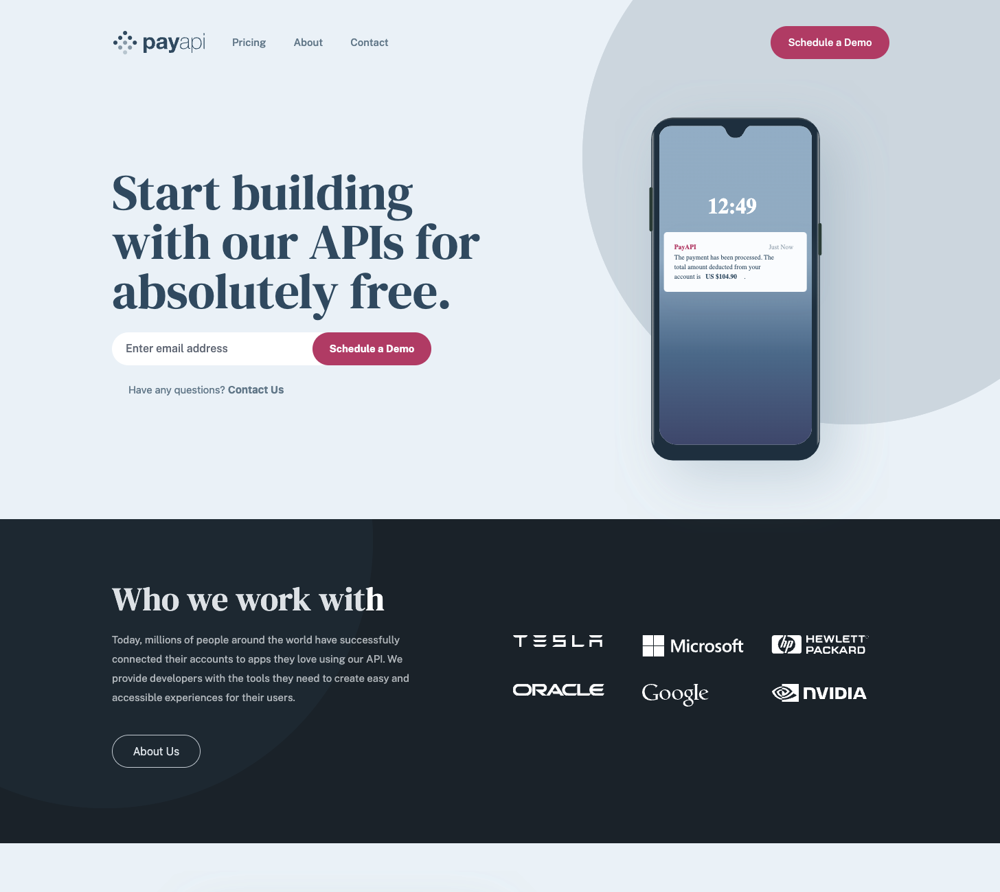

# Frontend Mentor - PayAPI multi-page website solution

This is a solution to the [PayAPI multi-page website challenge on Frontend Mentor](https://www.frontendmentor.io/challenges/payapi-multipage-website-FDLR1Y11e). Frontend Mentor challenges help you improve your coding skills by building realistic projects.

## Table of contents

- [Overview](#overview)
  - [Screenshot](#screenshot)
  - [Links](#links)
- [My process](#my-process)
  - [Built with](#built-with)
  - [What I learned](#what-i-learned)
- [Author](#author)

## Overview

### Screenshot

### Links

- [Solution LINK](https://www.frontendmentor.io/challenges/payapi-multipage-website-FDLR1Y11e/hub/pay-api-multi-page-website-reacy-sx78-H0-7m)
- [Live Site LINK](https://alvaro-frontend-mentor-projects.github.io/payapi-multi-page-website/?#/)

## My process

### Built with

- Semantic HTML5 markup
- React
- Tailwind CSS
- Github Pages

### What I learned

- useRef()

## Author

- Website - [Portfolio](https://alvaroormeno.github.io/alvaro-portfolio-v1/)
- Frontend Mentor - [@alvaroormeno](https://www.frontendmentor.io/profile/alvaroormeno)
- Instagram - [@alvaroormeno](https://www.instagram.com/alvaroormeno/)
